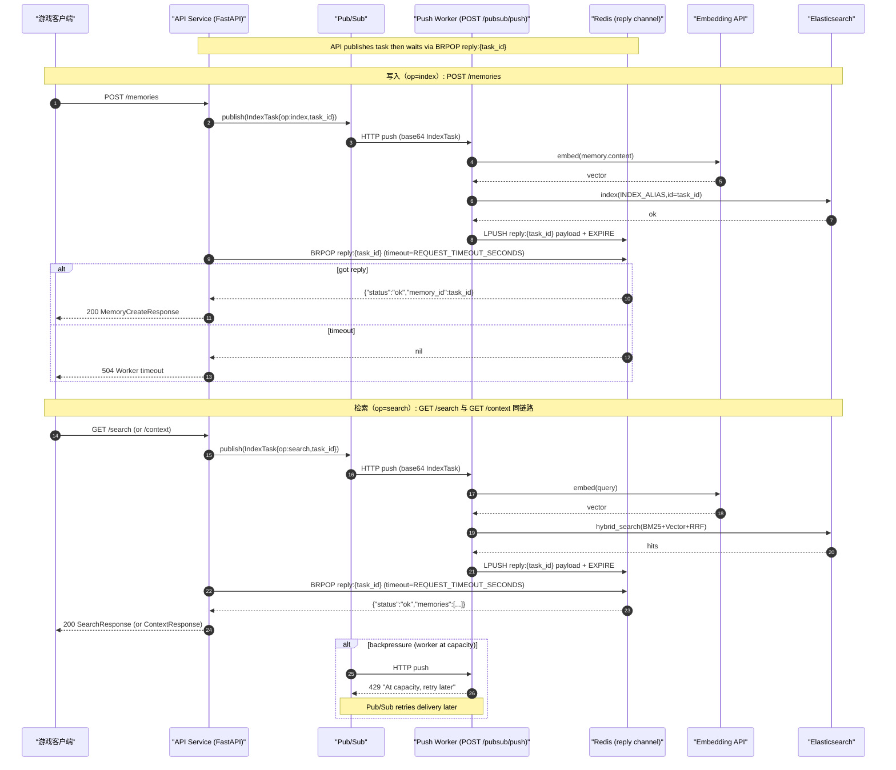

# NPC Memory RAG 系统

基于 Elasticsearch 的游戏 NPC 记忆检索增强生成(RAG)系统，支持混合检索、异步索引和 Cloud Run 部署。

## 项目结构

```
npc-memory-rag/
├── services/                # Cloud Run 多服务部署目录（各自独立构建）
│   ├── api/
│   │   ├── Dockerfile       # API Service 镜像构建入口
│   │   ├── requirements.txt
│   │   └── src/             # 为保证 import 路径不变，内置一份 src 副本
│   └── worker/
│       ├── Dockerfile       # Worker Service 镜像构建入口
│       ├── requirements.txt
│       └── src/             # 为保证 import 路径不变，内置一份 src 副本
├── examples/                # 示例脚本
│   └── benchmark.py         # 性能基准测试
└── docker-compose.yml       # ES + Redis + Prometheus
```

## 系统架构



## 核心特性

### 1. 混合检索（BM25 + Vector + RRF）

- BM25 关键词搜索 + 向量语义搜索
- RRF 融合排序：`score = sum(1 / (k + rank_i))`，k=60
- 记忆衰减机制：`importance *= exp(-0.01 * days)`

### 2. Embedding 服务

- 支持 OpenAI-compatible API（默认 Qwen3-Embedding-8B）
- 自动重试 + 指数退避（最多 3 次）
- 故障自动回退到 stub（无需配置即可运行）
- Embedding 缓存（Redis 优先，内存回退）
- 批量 embedding 优化吞吐

### 3. 异步索引（Pub/Sub）

- **Push Worker**：FastAPI HTTP 端点（`POST /pubsub/push`），适合 Cloud Run 自动伸缩
- **Request-Reply**：API 入队后通过 Redis BRPOP 阻塞等待 worker 结果
- **Backpressure**：信号量控制并发，超载返回 429 触发重试

### 4. REST API 服务

- 独立的 FastAPI 服务，支持 OpenAPI 文档
- `POST /memories` - 创建记忆（request-reply 模式）
- `GET /search` - 混合搜索（BM25 + Vector + RRF）
- `GET /context` - LLM 上下文准备（RAG 场景）

### 5. 缓存与监控

- Redis 查询结果缓存（TTL 5 分钟）
- Embedding 向量缓存（TTL 7 天）
- Prometheus 指标采集
- 支持 Grafana 可视化

### 6. 遗传算法优化（新功能）

- **参数自动优化**：使用遗传算法优化搜索参数（RRF k、衰减率、权重等）
- **适应度评估**：基于测试查询和 Ground Truth 评估参数质量
- **进化策略**：锦标赛选择、均匀交叉、自适应变异
- **API 集成**：`POST /optimize` 端点支持在线优化
- 详见：[遗传算法优化指南](docs/GENETIC_ALGORITHM.md)

## 快速开始

### 1. 启动开发环境

```bash
# 完整环境（ES + Redis + Prometheus）
docker-compose up -d

# 轻量开发（推荐）
docker-compose up -d es-coordinator kibana redis
```

### 2. 安装依赖

```bash
pip install -r services/api/requirements.txt
```

### 2.1 配置环境变量（推荐用 .env）

把示例文件复制成 `.env`，然后按你的环境改里面的值：

```bash
cp env.example .env
```

Windows PowerShell：

```bash
Copy-Item env.example .env
```

### 3. 初始化索引

```bash
cd services/api
python -c "from src.es_client import create_es_client, initialize_index; initialize_index(create_es_client())"
```

### 4. 启动服务

```bash
# 启动 API 服务
cd services/api
uvicorn src.api.app:app --host 0.0.0.0 --port 8000

# 启动 Worker 服务（必需，另开终端）
cd services/worker
uvicorn src.indexing.push_app:app --host 0.0.0.0 --port 8080
```

启动后访问 http://localhost:8000/docs 查看 OpenAPI 文档。

### 5. 异步模式（Worker）

异步模式需要配置 Pub/Sub 和 Redis：

```bash
# 建议用 .env 统一管理（见上面的 env.example -> .env）

# 启动 Worker
cd services/worker
uvicorn src.indexing.push_app:app --host 0.0.0.0 --port 8080
```

详见 [CLAUDE.md](CLAUDE.md)

## 环境变量

### 核心配置

| 变量 | 默认值 | 说明 |
|------|--------|------|
| `ES_URL` | http://localhost:9200 | Elasticsearch 地址 |
| `ES_API_KEY` | - | Elastic Cloud API Key |
| `INDEX_ALIAS` | npc_memories | ES 索引别名 |

### Embedding 配置

| 变量 | 默认值 | 说明 |
|------|--------|------|
| `EMBEDDING_PROVIDER` | openai_compatible | openai_compatible 或 stub |
| `EMBEDDING_BASE_URL` | - | Embedding API 地址 |
| `EMBEDDING_API_KEY` | - | Embedding API 密钥 |
| `EMBEDDING_MODEL` | qwen3-embedding-8b | 模型名 |
| `INDEX_VECTOR_DIMS` | 1024 | 向量维度 |
| `EMBEDDING_CACHE_ENABLED` | false | 启用 Embedding 缓存 |
| `EMBEDDING_TIMEOUT` | 30 | API 超时（秒） |
| `EMBEDDING_MAX_RETRIES` | 3 | 最大重试次数 |
| `MODELSCOPE_API_KEY` | - | 兼容旧配置（同 EMBEDDING_API_KEY） |

### 缓存配置

| 变量 | 默认值 | 说明 |
|------|--------|------|
| `REDIS_URL` | - | Redis 地址（必需，缓存 + request-reply） |
| `CACHE_TTL_SECONDS` | 300 | 查询缓存过期时间（秒） |

### Rerank 配置（可选，轻量精排）

| 变量 | 默认值 | 说明 |
|------|--------|------|
| `RERANK_ENABLED` | false | 是否开启 LLM 精排（单次 chat 调用，失败自动降级） |
| `RERANK_MODEL` | - | 用于 rerank 的 chat 模型名（复用 EMBEDDING_BASE_URL / EMBEDDING_API_KEY） |
| `RERANK_CANDIDATE_LIMIT` | 20 | 参与精排的候选条数上限（实际为 max(top_k, 该值)） |
| `RERANK_CONTENT_MAX_CHARS` | 240 | 每条记忆 content 截断长度（字符） |
| `RERANK_TIMEOUT_SECONDS` | 10 | rerank 模型调用超时（秒） |

### Worker 配置

| 变量 | 默认值 | 说明 |
|------|--------|------|
| `PORT` | 8080 | Worker 服务端口 |
| `MAX_INFLIGHT_TASKS` | 4 | 最大并发任务数（backpressure） |
| `REQUEST_TIMEOUT_SECONDS` | 25 | API 等待 worker 超时（秒） |
| `REPLY_TTL_SECONDS` | 60 | Redis 结果 TTL（秒） |

## Cloud Run 部署 (新加坡 asia-southeast1)

### 已部署服务

| 服务           | URL                                                            | 说明         |
| -------------- | -------------------------------------------------------------- | ------------ |
| API Service    | https://npc-memory-api-xxxxxxxxxxxx.asia-southeast1.run.app    | REST API     |
| Worker Service | https://npc-memory-worker-xxxxxxxxxxxx.asia-southeast1.run.app | 异步索引处理 |

### API 使用示例

```bash
# 写入记忆
curl -X POST https://npc-memory-api-xxxxxxxxxxxx.asia-southeast1.run.app/memories \
  -H "Content-Type: application/json" \
  -d '{"player_id":"player_1","npc_id":"npc_1","memory_type":"dialogue","content":"测试内容","importance":0.8}'

# 搜索记忆
curl "https://npc-memory-api-xxxxxxxxxxxx.asia-southeast1.run.app/search?player_id=player_1&npc_id=npc_1&query=测试"

# 查看 OpenAPI 文档
open https://npc-memory-api-xxxxxxxxxxxx.asia-southeast1.run.app/docs
```

详见 [CLAUDE.md](CLAUDE.md) 中的部署章节。

## 技术栈

- **Elasticsearch 8.x**: 混合检索（BM25 + HNSW 向量索引）
- **OpenAI-compatible API**: Embedding 生成（默认 Qwen3-Embedding-8B）
- **Google Cloud Pub/Sub**: 异步任务队列（Push 模式）
- **Redis**: 查询缓存 + Embedding 缓存 + Request-Reply 通道
- **FastAPI**: API Service + Worker Service
- **Prometheus**: 监控指标（延迟、吞吐、缓存命中率）

## 已完成功能

- [X] 模块化设计（api/memory/indexing）
- [X] REST API 服务（FastAPI + OpenAPI）
- [X] 混合检索（BM25 + Vector + RRF）
- [X] 真实 Embedding（Qwen3）
- [X] 异步写入模式（Pub/Sub + Worker + Redis request-reply）
- [X] Redis 查询缓存
- [X] Prometheus 监控
- [X] Push 模式 Worker
- [X] DLQ 支持
- [X] Cloud Run 双服务部署（API + Worker）
- [X] 遗传算法参数优化（GA Optimizer）
- [X] 真实 Embedding（Qwen3）
- [X] 异步写入模式（Pub/Sub + Worker + Redis request-reply）
- [X] Redis 查询缓存
- [X] Prometheus 监控
- [X] Push 模式 Worker
- [X] DLQ 支持
- [X] Cloud Run 双服务部署（API + Worker）
