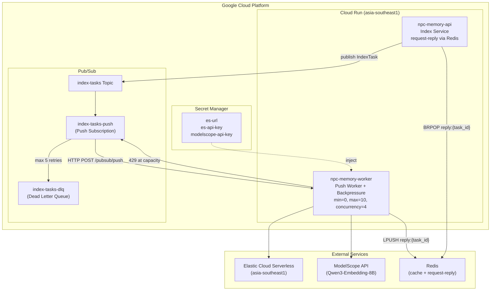
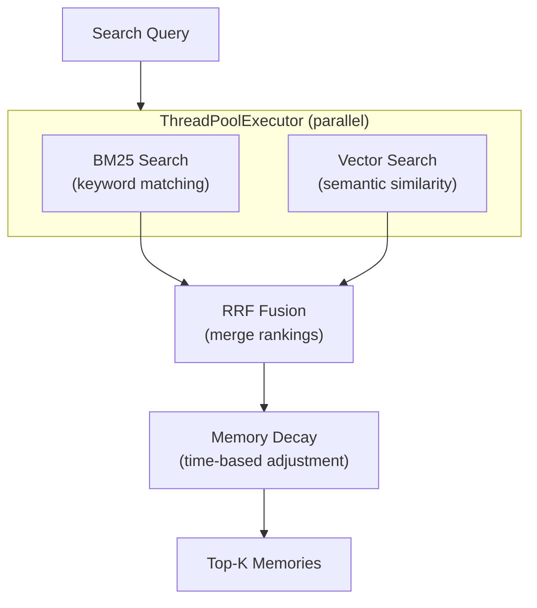

# NPC Memory RAG System Design Document

**Version**: 1.2.0
**Status**: Released
**Last Updated**: 2026-01-02

---

## Document Control

### Revision History

| Version | Date | Author | Description |
|---------|------|--------|-------------|
| 1.0.0 | 2026-01-01 | Development Team | Initial release |
| 1.2.0 | 2026-01-02 | Development Team | Push-only + request-reply (Redis) for write/search; remove pull mode |

### Related Documents

| Document | Description |
|----------|-------------|
| [ARCHITECTURE.md](./ARCHITECTURE.md) | High-level architecture overview |
| [API_REFERENCE.md](./api/API_REFERENCE.md) | Detailed API documentation |
| [openapi.yaml](./api/openapi.yaml) | OpenAPI 3.0 specification |
| [CLAUDE.md](../CLAUDE.md) | Development guidelines |

---

## 1. Glossary

| Term | Definition |
|------|------------|
| **RAG** | Retrieval-Augmented Generation，检索增强生成，通过检索相关上下文来增强 LLM 回复质量 |
| **BM25** | Best Match 25，基于词频的经典信息检索算法 |
| **RRF** | Reciprocal Rank Fusion，倒数排名融合，用于合并多个排序列表 |
| **HNSW** | Hierarchical Navigable Small World，高效的近似最近邻搜索算法 |
| **Pub/Sub** | Google Cloud Pub/Sub，异步消息队列服务 |
| **Cloud Run** | Google Cloud 无服务器容器平台 |
| **Embedding** | 将文本转换为稠密向量表示的过程 |

---

## 2. Project Overview

### 2.1 Background

在 LLM 驱动的游戏中，NPC 需要记住与每个玩家的历史互动，实现个性化对话体验。例如：玩家曾帮助 NPC 找回丢失的物品，下次见面时 NPC 应该记得并表示感谢。

本系统基于 Elasticsearch 构建，支持混合检索（BM25 + Vector + RRF）和异步索引，部署于 Google Cloud Run。

### 2.2 Business Value

- **个性化体验**: NPC 能够记住并引用与玩家的历史互动
- **情感连接**: 基于情感标签的记忆检索增强角色深度
- **可扩展性**: 支持百万级玩家、十万级 NPC 的记忆存储与检索

### 2.3 User Stories

| ID | As a... | I want to... | So that... | Priority |
|----|---------|--------------|------------|----------|
| US-001 | Game Server | 存储玩家与 NPC 的对话记忆 | NPC 可以在未来对话中引用 | P0 |
| US-002 | Game Server | 检索与当前话题相关的历史记忆 | 为 LLM 提供上下文 | P0 |
| US-003 | Game Server | 批量导入历史互动数据 | 快速初始化 NPC 记忆库 | P1 |
| US-004 | DevOps | 监控系统健康状态 | 及时发现和处理问题 | P1 |

### 2.4 Scope

**In Scope:**
- 记忆存储与检索服务
- 混合检索算法（BM25 + Vector + RRF）
- 异步索引构建（Pub/Sub + Worker）
- Cloud Run 部署与监控

**Out of Scope:**
- LLM 对话生成（由上游服务负责）
- 玩家身份认证
- 游戏逻辑处理

---

## 3. System Architecture

### 3.1 High-Level Architecture

```
┌─────────────────────────────────────────────────────────────────────┐
│                          Game Server                                 │
└─────────────────────────────────┬───────────────────────────────────┘
                                  │
                                  ▼
┌─────────────────────────────────────────────────────────────────────┐
│                      Index Service (API)                             │
│        /memories  /search  /context  /health  /ready  /metrics        │
└─────────────────────────────────┬───────────────────────────────────┘
                                  │ publish(IndexTask: op=index/search)
                                  ▼
┌─────────────────────────────────────────────────────────────────────┐
│                      Google Pub/Sub Topic                            │
└─────────────────────────────────┬───────────────────────────────────┘
                                  │ HTTP push
                                  ▼
┌─────────────────────────────────────────────────────────────────────┐
│                 Embedding Worker (Push FastAPI)                       │
│                    POST /pubsub/push + backpressure(429)              │
└───────────────┬───────────────────────────────┬─────────────────────┘
                │                               │
                ▼                               ▼
      ┌───────────────────┐           ┌──────────────────────────────┐
      │ Elasticsearch      │           │ Redis                         │
      │ (hybrid search)    │           │ reply:{task_id} (LPUSH/BRPOP) │
      └───────────────────┘           └──────────────────────────────┘
```

### 3.2 Three-Layer Architecture

#### Layer 1: Facade Layer

**File**: `src/memory_service.py`

| Component | Responsibility |
|-----------|----------------|
| `NPCMemoryService` | 统一入口，组合各子模块 |
| `RedisCacheAdapter` | 查询结果缓存（可选） |

```python
class NPCMemoryService:
    def __init__(self, es_client, embedding_service, cache_client=None, pubsub_publisher=None):
        self.searcher = MemorySearcher(es_client, embedding_service)
        self.writer = MemoryWriter(es_client, embedding_service, pubsub_publisher=pubsub_publisher)
```

#### Layer 2: Core Memory Module

**Directory**: `src/memory/`

| File | Component | Responsibility |
|------|-----------|----------------|
| `models.py` | `Memory`, `MemoryType`, `MemoryContext` | 数据模型定义 |
| `embedding.py` | `EmbeddingService` | Embedding 生成（ModelScope Qwen3） |
| `es_schema.py` | Index settings | ES 索引配置（30分片、HNSW） |
| `search.py` | `MemorySearcher` | 混合检索 + RRF 融合 |
| `write.py` | `MemoryWriter` | 异步写入（async-only，发布到 Pub/Sub） |

#### Layer 3: Async Indexing Module

**Directory**: `src/indexing/`

| File | Component | Responsibility |
|------|-----------|----------------|
| `tasks.py` | `IndexTask` | 索引任务定义与序列化 |
| `pubsub_client.py` | `PubSubPublisher` | Pub/Sub 发布封装 |
| `push_app.py` | FastAPI App | Push Worker（带 backpressure） |

### 3.3 Deployment Architecture



**自动伸缩机制**：
- `min-instances=0`：空闲时缩容到零，节省成本
- Worker 满载返回 429，Pub/Sub 暂缓推送（backpressure）
- Cloud Run 根据请求队列自动扩容

---

## 4. Data Model

### 4.1 Memory Entity

**File**: `src/memory/models.py:22-49`

```python
@dataclass
class Memory:
    id: str                           # Unique identifier (UUID)
    player_id: str                    # Player identifier
    npc_id: str                       # NPC identifier
    memory_type: MemoryType           # Type of memory
    content: str                      # Memory content text
    content_vector: List[float]       # Embedding vector (1024 dims)
    emotion_tags: List[str]           # Emotion tags (e.g., ["感谢", "信任"])
    importance: float                 # Importance score (0.0 - 1.0)
    timestamp: datetime               # Creation timestamp
    game_context: Dict[str, Any]      # Additional context
```

### 4.2 MemoryType Enum

**File**: `src/memory/models.py:11-18`

| Value | Description | Example |
|-------|-------------|---------|
| `DIALOGUE` | 对话交互 | "玩家询问铁匠关于武器的问题" |
| `QUEST` | 任务相关 | "玩家帮助找回失落的锤子" |
| `TRADE` | 交易行为 | "玩家购买了一把剑" |
| `GIFT` | 赠送物品 | "玩家送给 NPC 一瓶药水" |
| `COMBAT` | 战斗事件 | "玩家帮助 NPC 击退了强盗" |
| `EMOTION` | 情感变化 | "NPC 对玩家产生了信任" |

### 4.3 IndexTask

**File**: `src/indexing/tasks.py:12-74`

```python
@dataclass
class IndexTask:
    task_id: str          # Unique task ID (used as ES document _id for idempotency)
    player_id: str
    npc_id: str
    content: str
    memory_type: str      # String value of MemoryType (op=index) or placeholder (op=search)
    timestamp: str        # ISO 8601 format
    op: str = "index"     # index | search
    importance: float = 0.5
    emotion_tags: list = None
    game_context: dict = None
    top_k: int = 5
    memory_types: Optional[List[str]] = None
    time_range_days: Optional[int] = None
```

### 4.4 Elasticsearch Mapping

**File**: `src/memory/es_schema.py:64-104`

```json
{
  "settings": {
    "number_of_shards": 30,
    "number_of_replicas": 1,
    "refresh_interval": "5s",
    "index.routing.allocation.require.data": "hot"
  },
  "mappings": {
    "properties": {
      "player_id": { "type": "keyword" },
      "npc_id": { "type": "keyword" },
      "memory_type": { "type": "keyword" },
      "content": {
        "type": "text",
        "analyzer": "memory_analyzer"
      },
      "content_vector": {
        "type": "dense_vector",
        "dims": 1024,
        "index": true,
        "similarity": "cosine",
        "index_options": {
          "type": "hnsw",
          "m": 16,
          "ef_construction": 100
        }
      },
      "emotion_tags": { "type": "keyword" },
      "importance": { "type": "float" },
      "timestamp": { "type": "date" },
      "game_context": { "type": "object" }
    }
  }
}
```

---

## 5. Core Algorithms

### 5.1 Hybrid Search Flow

**File**: `src/memory/search.py:25-73`



**Implementation:**

```python
# src/memory/search.py:51-71
# Execute both searches in parallel using ThreadPoolExecutor
future_bm25 = self._executor.submit(
    self._bm25_search, query, filters, npc_id, top_k * 2
)
future_vector = self._executor.submit(
    self._vector_search, query, filters, npc_id, top_k * 2
)

# Wait for both results with timeout
bm25_results = future_bm25.result(timeout=15)
vector_results = future_vector.result(timeout=15)

# RRF fusion
fused_results = self._rrf_fusion(bm25_results, vector_results, top_k)

# Apply memory decay
memories = self._apply_memory_decay(fused_results)
```

### 5.2 RRF Fusion Algorithm

**File**: `src/memory/search.py:154-182`

**Formula:**

```
RRF(doc) = Σ 1 / (k + rank_i(doc))
```

Where:
- `k = 60` (smoothing parameter)
- `rank_i` is the rank of document in search result i

**Implementation:**

```python
# Pre-build id -> doc mapping for O(1) lookup (optimized from O(n²))
doc_map = {r["id"]: r["doc"] for r in bm25_results}
for r in vector_results:
    if r["id"] not in doc_map:
        doc_map[r["id"]] = r["doc"]

# Calculate RRF scores with O(1) doc lookup
for doc_id in all_ids:
    score = 0
    if doc_id in bm25_ranks:
        score += 1.0 / (k + bm25_ranks[doc_id])
    if doc_id in vector_ranks:
        score += 1.0 / (k + vector_ranks[doc_id])
```

### 5.3 Memory Decay Mechanism

**File**: `src/memory/search.py:196-229`

**Formula:**

```
decayed_importance = importance × e^(-λ × days)
```

Where:
- `λ = 0.01` (decay rate)
- `days` = number of days since memory creation

**Purpose:** Simulate human forgetting curve - older memories have lower importance.

---

## 6. API Specification

### 6.1 Index Service (API) Endpoints

**Base URL**: `https://npc-memory-api-{project_number}.asia-southeast1.run.app`

| Method | Endpoint | Description |
|--------|----------|-------------|
| POST | `/memories` | Publish index task then wait reply (request-reply) |
| GET | `/search` | Publish search task then wait reply (request-reply) |
| GET | `/context` | Prepare LLM context (request-reply via Worker) |
| GET | `/health` | Health check |
| GET | `/ready` | Readiness check (verifies ES connection) |
| GET | `/metrics` | Prometheus metrics |
| GET | `/docs` | Swagger UI |

### 6.2 Push Worker Endpoints

**Base URL**: `https://npc-memory-worker-{project_number}.asia-southeast1.run.app`

| Method | Endpoint | Description |
|--------|----------|-------------|
| POST | `/pubsub/push` | Handle Pub/Sub push delivery |
| GET | `/health` | Health check |
| GET | `/ready` | Readiness check (verifies ES connection) |
| GET | `/metrics` | Prometheus metrics |
| GET | `/docs` | Swagger UI |
| GET | `/redoc` | ReDoc documentation |

### 6.3 POST /pubsub/push

**Request Format:**

```json
{
  "message": {
    "data": "<base64-encoded IndexTask JSON>",
    "messageId": "123456789",
    "publishTime": "2025-01-01T00:00:00.000Z"
  },
  "subscription": "projects/npc-memory-rag/subscriptions/index-tasks-push"
}
```

**Response Codes:**

| Code | Meaning | Action |
|------|---------|--------|
| 200 | Success | Message acknowledged |
| 400 | Invalid format | Message acknowledged (no retry) |
| 429 | At capacity | Backpressure, Pub/Sub will retry |
| 500 | Processing failed | Message will be retried by Pub/Sub |

**Success Response:**

```json
{
  "status": "ok",
  "task_id": "abc-123-def"
}
```

### 6.4 Error Response Format

```json
{
  "detail": "Error message description"
}
```

---

## 7. Module Design

### 7.1 Module Dependency Graph

```
memory_service.py (Facade)
    ├─► memory/search.py
    │       └─► memory/models.py
    │       └─► memory/embedding.py
    │
    ├─► memory/write.py
    │       ├─► memory/models.py
    │       └─► indexing/tasks.py
    │       └─► indexing/pubsub_client.py
    │
    └─► metrics.py

indexing/push_app.py
    ├─► indexing/tasks.py
    ├─► memory/models.py
    ├─► memory/embedding.py
    ├─► es_client.py
    └─► metrics.py

es_client.py
    └─► memory/es_schema.py
```

### 7.2 Key Class Interfaces

#### MemorySearcher

**File**: `src/memory/search.py:14-236`

```python
class MemorySearcher:
    _executor = ThreadPoolExecutor(max_workers=4, thread_name_prefix="search_")

    def __init__(self, es_client, embedding_service, index_alias: str = "npc_memories")

    def search_memories(
        self,
        player_id: str,
        npc_id: str,
        query: str,
        top_k: int = 5,
        memory_types: List[MemoryType] = None,
        time_range_days: int = None
    ) -> List[Memory]

    def _bm25_search(query, filters, npc_id, size) -> List[dict]
    def _vector_search(query, filters, npc_id, size) -> List[dict]
    def _rrf_fusion(bm25_results, vector_results, top_k, k=60) -> List[dict]
    def _apply_memory_decay(results) -> List[Memory]
```

#### EmbeddingService

**File**: `src/memory/embedding.py:28-177`

```python
class EmbeddingService:
    def __init__(self, model_name: str = None, dimension: int = None)

    def embed(self, text: str) -> List[float]          # Single text embedding
    def batch_embed(self, texts: List[str]) -> List[List[float]]  # Batch embedding

    # Thread-safe cache with threading.Lock
    # Automatic fallback to stub if API unavailable
```

#### MemoryWriter

**File**: `src/memory/write.py:12-123`

```python
class MemoryWriter:
    def __init__(self, es_client, embedding_service, index_alias, pubsub_publisher=None)

    def add_memory(self, memory: Memory, async_index: bool = None) -> str
    def bulk_add_memories(self, memories: List[Memory], batch_size: int = 500)

    # Async mode: publishes to Pub/Sub instead of direct ES write
```

---

## 8. Non-Functional Requirements

### 8.1 Performance Targets

| Metric | Target | Measurement |
|--------|--------|-------------|
| Search QPS | 10,000 | Concurrent requests per second |
| Search P99 Latency | < 50ms | 99th percentile response time |
| Write Throughput | 1,000 docs/sec | Bulk indexing rate |
| Embedding Latency | < 5s | ModelScope API call |

### 8.2 High Concurrency Design

| Component | Strategy | Implementation |
|-----------|----------|----------------|
| Parallel Search | ThreadPoolExecutor | `search.py:17-18` - 4 worker threads |
| Thread-safe Cache | threading.Lock | `embedding.py:39` - Lock for cache R/W |
| Connection Pool | ES client config | `es_client.py:40-45` - max_retries, timeout |
| Async Processing | run_in_executor | `push_app.py:163-164` - Non-blocking I/O |

### 8.3 Availability & Fault Tolerance

| Aspect | Design |
|--------|--------|
| ES High Availability | 30 shards, 1 replica, Elastic Cloud managed |
| Message Retry | Pub/Sub with 5 max retries + DLQ |
| Embedding Fallback | Auto fallback to stub if API fails |
| Health Checks | /health (liveness), /ready (readiness) |

### 8.4 Prometheus Metrics

**File**: `src/metrics.py:28-63`

| Metric | Type | Description |
|--------|------|-------------|
| `npc_memory_cache_hits_total` | Counter | Cache hit count |
| `npc_memory_cache_misses_total` | Counter | Cache miss count |
| `npc_memory_embedding_latency_seconds` | Histogram | Embedding API latency |
| `npc_memory_embedding_requests_total` | Counter | Embedding requests by status |
| `npc_memory_worker_messages_pulled_total` | Counter | Messages pulled from Pub/Sub |
| `npc_memory_worker_messages_processed_total` | Counter | Messages processed by status |
| `npc_memory_worker_bulk_latency_seconds` | Histogram | ES bulk write latency |

---

## 9. Configuration

### 9.1 Environment Variables

#### Core Configuration

| Variable | Default | Required | Description |
|----------|---------|----------|-------------|
| `ES_URL` | http://localhost:9200 | Yes | Elasticsearch URL |
| `ES_API_KEY` | - | No | Elastic Cloud API Key |
| `INDEX_ALIAS` | npc_memories | No | ES index alias |

#### Pub/Sub Configuration

| Variable | Default | Required | Description |
|----------|---------|----------|-------------|
| `PUBSUB_PROJECT_ID` | - | Yes | GCP project ID |
| `PUBSUB_TOPIC` | index-tasks | Yes | Pub/Sub topic name |
| `PUBSUB_PRODUCER` | - | Yes | Pub/Sub producer tag |

*Required for request-reply endpoints (/memories, /search, /context)

#### Embedding Configuration

| Variable | Default | Required | Description |
|----------|---------|----------|-------------|
| `EMBEDDING_PROVIDER` | openai_compatible | No | Provider: openai_compatible or stub |
| `EMBEDDING_API_KEY` | - | Yes* | Embedding API key (preferred) |
| `EMBEDDING_BASE_URL` | https://your-embedding-api.com/v1 | No | API base URL |
| `EMBEDDING_MODEL` | qwen3-embedding-8b | No | Model name |
| `INDEX_VECTOR_DIMS` | 1024 | No | Vector dimension |
| `EMBEDDING_CACHE_ENABLED` | false | No | Enable memory cache |
| `EMBEDDING_TIMEOUT` | 30 | No | API timeout (seconds) |
| `EMBEDDING_MAX_RETRIES` | 3 | No | Max retry attempts |
| `MODELSCOPE_API_KEY` | - | No | Legacy alias for backward compatibility |
| `MODELSCOPE_BASE_URL` | - | No | Legacy alias for backward compatibility |

*Required when EMBEDDING_PROVIDER=openai_compatible

#### Cache Configuration

| Variable | Default | Required | Description |
|----------|---------|----------|-------------|
| `REDIS_URL` | - | Yes* | Redis connection URL (cache + request-reply) |
| `CACHE_TTL_SECONDS` | 300 | No | Cache TTL |

*Required for request-reply endpoints (/memories, /search)

#### Worker Configuration

| Variable | Default | Required | Description |
|----------|---------|----------|-------------|
| `PORT` | 8080 | No | HTTP server port |
| `MAX_INFLIGHT_TASKS` | 4 | No | Max concurrent tasks (backpressure) |
| `REQUEST_TIMEOUT_SECONDS` | 25 | No | API wait timeout (seconds) |
| `REPLY_TTL_SECONDS` | 60 | No | Reply TTL in Redis (seconds) |

#### Elasticsearch Configuration

| Variable | Default | Required | Description |
|----------|---------|----------|-------------|
| `ES_ROUTING_ENABLED` | false | No | Enable routing (disable for Serverless) |

### 9.2 Dependencies

**File**: `requirements.txt`

| Package | Purpose |
|---------|---------|
| elasticsearch>=8.0.0 | ES client |
| fastapi>=0.100.0 | Push worker API |
| uvicorn>=0.23.0 | ASGI server |
| google-cloud-pubsub>=2.18.0 | Pub/Sub client |
| openai>=1.0.0 | ModelScope compatible client |
| prometheus-client>=0.17.0 | Metrics |
| redis>=4.5.0 | Cache (optional) |

---

## 10. Acceptance Criteria

### 10.1 Functional Acceptance

| ID | Scenario | Expected Result | Test Method |
|----|----------|-----------------|-------------|
| FA-001 | Store memory via sync write | Memory indexed to ES within 5s | `examples/publish_task.py` |
| FA-002 | Store memory via async write | Task published to Pub/Sub, Worker processes | `gcloud pubsub topics publish` |
| FA-003 | Hybrid search with query | Returns relevant memories ranked by RRF | `examples/live_demo.py` |
| FA-004 | Memory decay over time | Older memories have lower importance | Unit test |
| FA-005 | Health check endpoint | Returns `{"status": "healthy"}` | `curl /health` |
| FA-006 | Readiness check with ES | Returns `{"status": "ready"}` when ES connected | `curl /ready` |

### 10.2 Performance Acceptance

| ID | Scenario | Threshold | Test Method |
|----|----------|-----------|-------------|
| PA-001 | Search latency (single) | P99 < 100ms | Load test |
| PA-002 | Search throughput | > 100 QPS | Concurrent requests |
| PA-003 | Bulk write throughput | > 500 docs/sec | `bulk_add_memories()` |
| PA-004 | Worker message processing | < 5s per message | Pub/Sub latency metrics |

### 10.3 Verification Commands

```bash
# Health check
curl https://npc-memory-worker-xxx.asia-southeast1.run.app/health

# Readiness check
curl https://npc-memory-worker-xxx.asia-southeast1.run.app/ready

# Metrics
curl https://npc-memory-worker-xxx.asia-southeast1.run.app/metrics

# Live demo (search verification)
python examples/live_demo.py

# Publish test message
gcloud pubsub topics publish index-tasks --message='{
  "task_id": "test-001",
  "player_id": "player_1",
  "npc_id": "npc_blacksmith",
  "memory_type": "dialogue",
  "content": "Test memory content",
  "importance": 0.8,
  "emotion_tags": ["happy"],
  "timestamp": "2025-01-01T00:00:00",
  "game_context": {}
}'
```

---

## Appendix A: Quick Start

### Local Development

```bash
# 1. Install dependencies
pip install -r requirements.txt

# 2. Start local ES
docker-compose up -d

# 3. Initialize ES index
python examples/init_es.py

# 4. Run demo
python demo.py
```

### Cloud Deployment

```bash
# 1. Configure secrets
gcloud secrets create es-url --data-file=-
gcloud secrets create es-api-key --data-file=-
gcloud secrets create modelscope-api-key --data-file=-

# 2. Deploy to Cloud Run (asia-southeast1, same region as ES)
gcloud run deploy npc-memory-worker \
  --source . \
  --region asia-southeast1 \
  --set-env-vars "PUBSUB_PROJECT_ID=$(gcloud config get-value project),MAX_INFLIGHT_TASKS=4" \
  --set-secrets "ES_URL=es-url:latest,ES_API_KEY=es-api-key:latest,MODELSCOPE_API_KEY=modelscope-api-key:latest" \
  --min-instances 0 \
  --max-instances 10 \
  --concurrency 4

# 3. Create Pub/Sub resources
gcloud pubsub topics create index-tasks
gcloud pubsub subscriptions create index-tasks-push \
  --topic=index-tasks \
  --push-endpoint=https://npc-memory-worker-xxx.asia-southeast1.run.app/pubsub/push \
  --ack-deadline=60 \
  --max-delivery-attempts=5 \
  --dead-letter-topic=index-tasks-dlq
```

---

*Document generated for NPC Memory RAG System v1.0.0*
