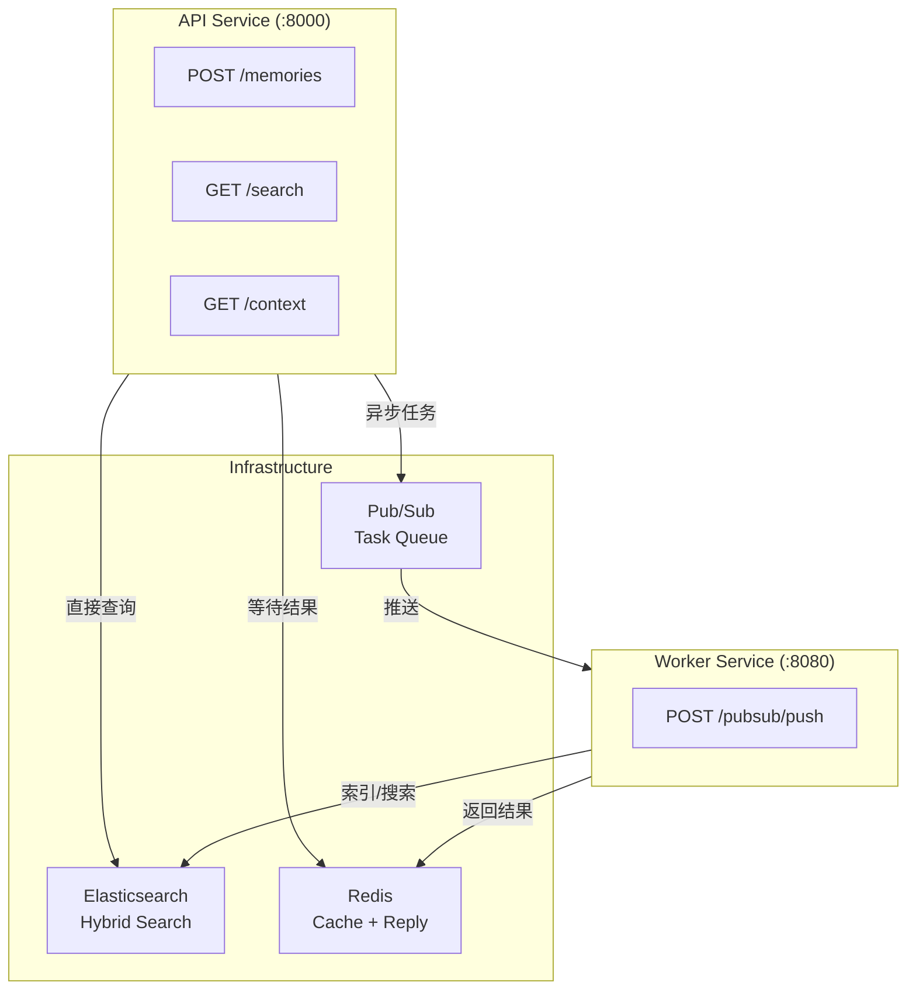

# NPC Memory RAG API Reference

## Overview

NPC Memory RAG 系统提供两个独立的 FastAPI 服务：

| 服务 | 端口 | 说明 |
|------|------|------|
| **API Service** | 8000 | 面向客户端的 REST API，提供记忆写入、搜索和上下文准备 |
| **Worker Service** | 8080 | 内部服务，处理 Pub/Sub 推送的异步任务 |

## 系统架构



---

# Part 1: API Service

面向游戏客户端的 REST API。

**Base URL**:
- Production: `https://npc-memory-api-{project_number}.asia-southeast1.run.app`
- Local: `http://localhost:8000`

**OpenAPI Docs**: `http://localhost:8000/docs`

---

## POST /memories

创建新记忆（异步 request-reply 模式）。

API 将任务发送到 Pub/Sub，Worker 处理后通过 Redis 返回结果，API 等待并返回给客户端。

### Request

| Field | Type | Required | Default | Description |
|-------|------|----------|---------|-------------|
| player_id | string | Yes | - | 玩家 ID |
| npc_id | string | Yes | - | NPC ID |
| memory_type | string | Yes | - | 记忆类型 |
| content | string | Yes | - | 记忆内容（1-2000 字符） |
| importance | float | No | 0.5 | 重要性评分 (0-1) |
| emotion_tags | array | No | [] | 情感标签 |
| game_context | object | No | {} | 游戏上下文 |

**memory_type 可选值**: `dialogue`, `quest`, `trade`, `gift`, `combat`, `emotion`

### Request Example

```bash
curl -X POST http://localhost:8000/memories \
  -H "Content-Type: application/json" \
  -d '{
    "player_id": "player_123",
    "npc_id": "blacksmith_01",
    "memory_type": "quest",
    "content": "玩家帮助铁匠找回了被盗的祖传锤子",
    "importance": 0.8,
    "emotion_tags": ["感谢", "信任"],
    "game_context": {"location": "village_01", "quest_id": "find_hammer"}
  }'
```

### Response (200)

```json
{
  "task_id": "550e8400-e29b-41d4-a716-446655440000",
  "memory_id": "550e8400-e29b-41d4-a716-446655440000",
  "status": "completed",
  "message": "Memory indexed"
}
```

### Errors

| Status | Description |
|--------|-------------|
| 503 | 异步索引不可用（检查 INDEX_ASYNC_ENABLED 和 REDIS_URL） |
| 504 | Worker 超时 |
| 500 | 处理失败 |

---

## GET /search

混合搜索记忆（BM25 + Vector + RRF 融合）。

### Algorithm

1. 并行执行 BM25（关键词）和 Vector（语义）搜索
2. RRF 融合排序：`score = sum(1 / (k + rank_i))`，k=60
3. 记忆衰减：`importance *= exp(-0.01 * days)`

### Query Parameters

| Parameter | Type | Required | Default | Description |
|-----------|------|----------|---------|-------------|
| player_id | string | Yes | - | 玩家 ID |
| npc_id | string | Yes | - | NPC ID |
| query | string | Yes | - | 搜索查询文本 |
| top_k | int | No | 5 | 返回结果数量 (1-50) |
| memory_types | string | No | - | 记忆类型过滤，逗号分隔 |
| time_range_days | int | No | - | 时间范围过滤（天） |

### Request Example

```bash
curl "http://localhost:8000/search?player_id=player_123&npc_id=blacksmith_01&query=锤子&top_k=5"
```

### Response (200)

```json
{
  "memories": [
    {
      "id": "mem_001",
      "player_id": "player_123",
      "npc_id": "blacksmith_01",
      "memory_type": "quest",
      "content": "玩家帮助铁匠找回了祖传锤子",
      "importance": 0.72,
      "emotion_tags": ["感谢", "信任"],
      "timestamp": "2024-01-15T10:30:00",
      "game_context": {"location": "village_01"}
    }
  ],
  "total": 1,
  "query_time_ms": 45.2
}
```

---

## GET /context

为 LLM 准备记忆上下文（RAG 场景）。

### Query Parameters

| Parameter | Type | Required | Default | Description |
|-----------|------|----------|---------|-------------|
| player_id | string | Yes | - | 玩家 ID |
| npc_id | string | Yes | - | NPC ID |
| query | string | Yes | - | 当前对话/话题 |
| max_memories | int | No | 10 | 最大记忆数量 (1-50) |

### Request Example

```bash
curl "http://localhost:8000/context?player_id=player_123&npc_id=blacksmith_01&query=你还记得我吗"
```

### Response (200)

```json
{
  "memories": [...],
  "summary": "玩家曾帮助铁匠找回祖传锤子，建立了信任关系",
  "total_interactions": 5,
  "last_interaction": "2024-01-15T10:30:00",
  "relationship_score": 0.75
}
```

---

## GET /health

健康检查端点（存活探针）。

```bash
curl http://localhost:8000/health
```

**Response (200)**

```json
{"status": "healthy"}
```

---

## GET /ready

就绪检查端点（就绪探针），验证 ES 连接。

```bash
curl http://localhost:8000/ready
```

**Response (200)**

```json
{"status": "ready"}
```

**Response (503)**

```json
{"detail": "ES not reachable"}
```

---

## GET /metrics

Prometheus 指标端点。

```bash
curl http://localhost:8000/metrics
```

---

# Part 2: Worker Service

处理 Pub/Sub 推送的内部服务。

**Base URL**:
- Production: `https://npc-memory-worker-{project_number}.asia-southeast1.run.app`
- Local: `http://localhost:8080`

---

## POST /pubsub/push

处理 Pub/Sub 推送消息。

### Backpressure 机制

- 使用 `MAX_INFLIGHT_TASKS` 信号量控制并发
- 达到容量时返回 429，触发 Pub/Sub 重试
- Cloud Run 根据请求队列自动伸缩

### Request

| Field | Type | Required | Description |
|-------|------|----------|-------------|
| message.data | string (base64) | Yes | Base64 编码的 IndexTask JSON |
| message.messageId | string | No | Pub/Sub 消息 ID |
| subscription | string | No | 订阅名称 |

### IndexTask JSON Schema

```json
{
  "task_id": "test-001",
  "player_id": "player_1",
  "npc_id": "npc_blacksmith",
  "memory_type": "dialogue",
  "content": "The blacksmith offered me a sword.",
  "importance": 0.8,
  "emotion_tags": ["happy"],
  "timestamp": "2025-01-01T00:00:00",
  "game_context": {},
  "op": "index"
}
```

**op 字段**:
- `index`: 索引记忆到 ES
- `search`: 执行搜索并返回结果

### Response

| Status | Description |
|--------|-------------|
| 200 | 处理成功（ack） |
| 204 | 消息格式无效，丢弃（ack，不重试） |
| 429 | 容量已满（触发重试） |
| 500 | 处理失败（nack，会重试） |

---

## GET /health

```bash
curl http://localhost:8080/health
```

**Response (200)**

```json
{"status": "healthy"}
```

---

## GET /ready

```bash
curl http://localhost:8080/ready
```

**Response (200)**

```json
{"status": "ready"}
```

---

## GET /metrics

Prometheus 指标端点。

**Available Metrics**

| Metric | Type | Description |
|--------|------|-------------|
| npc_memory_worker_messages_pulled_total | Counter | 拉取的消息总数 |
| npc_memory_worker_messages_processed_total | Counter | 处理的消息总数（按状态） |
| npc_memory_worker_bulk_latency_seconds | Histogram | ES 写入延迟 |
| npc_memory_embedding_latency_seconds | Histogram | Embedding 生成延迟 |
| npc_memory_embedding_requests_total | Counter | Embedding 请求总数 |

---

# Data Models

## MemoryType Enum

| Value | Description |
|-------|-------------|
| dialogue | NPC 对话互动 |
| quest | 任务相关记忆 |
| trade | 交易记录 |
| gift | 礼物交换 |
| combat | 战斗事件 |
| emotion | 情感状态变化 |

## Memory Document (Elasticsearch)

```json
{
  "_id": "mem_001",
  "player_id": "player_1",
  "npc_id": "npc_blacksmith",
  "memory_type": "dialogue",
  "content": "The blacksmith offered me a legendary sword.",
  "content_vector": [0.1, 0.2, ...],
  "emotion_tags": ["happy"],
  "importance": 0.8,
  "timestamp": "2025-01-01T00:00:00",
  "game_context": {
    "location": "village_smithy"
  }
}
```

---

# Environment Variables

## API Service

| Variable | Required | Default | Description |
|----------|----------|---------|-------------|
| ES_URL | Yes | http://localhost:9200 | Elasticsearch URL |
| ES_API_KEY | No | - | Elastic Cloud API Key |
| REDIS_URL | Yes | - | Redis URL（缓存 + reply） |
| INDEX_ASYNC_ENABLED | No | false | 启用异步索引 |
| REQUEST_TIMEOUT_SECONDS | No | 25 | 等待 Worker 超时（秒） |

## Worker Service

| Variable | Required | Default | Description |
|----------|----------|---------|-------------|
| ES_URL | Yes | http://localhost:9200 | Elasticsearch URL |
| ES_API_KEY | No | - | Elastic Cloud API Key |
| REDIS_URL | Yes | - | Redis URL（reply 通道） |
| EMBEDDING_API_KEY | Yes | - | Embedding API Key |
| EMBEDDING_BASE_URL | No | - | Embedding API URL |
| EMBEDDING_MODEL | No | qwen3-embedding-8b | Embedding 模型名 |
| MAX_INFLIGHT_TASKS | No | 4 | 最大并发任务数 |
| REPLY_TTL_SECONDS | No | 60 | Redis 结果 TTL（秒） |
| PORT | No | 8080 | HTTP 服务端口 |

---

# Deployment

See [CLAUDE.md](../../CLAUDE.md) for complete Cloud Run deployment instructions.

## Quick Deploy

### API Service

```bash
gcloud run deploy npc-memory-api \
  --source . \
  --region asia-southeast1 \
  --command "uvicorn" \
  --args "src.api.app:app,--host,0.0.0.0,--port,8080" \
  --set-env-vars "INDEX_ASYNC_ENABLED=true" \
  --set-secrets "ES_URL=es-url:latest,ES_API_KEY=es-api-key:latest,REDIS_URL=redis-url:latest" \
  --allow-unauthenticated
```

### Worker Service

```bash
gcloud run deploy npc-memory-worker \
  --source . \
  --region asia-southeast1 \
  --command "uvicorn" \
  --args "src.indexing.push_app:app,--host,0.0.0.0,--port,8080" \
  --set-env-vars "MAX_INFLIGHT_TASKS=4" \
  --set-secrets "ES_URL=es-url:latest,ES_API_KEY=es-api-key:latest,REDIS_URL=redis-url:latest,EMBEDDING_API_KEY=embedding-key:latest" \
  --min-instances 0 \
  --max-instances 10 \
  --concurrency 4 \
  --allow-unauthenticated
```
